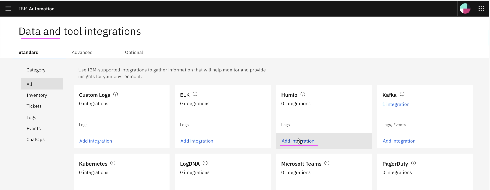
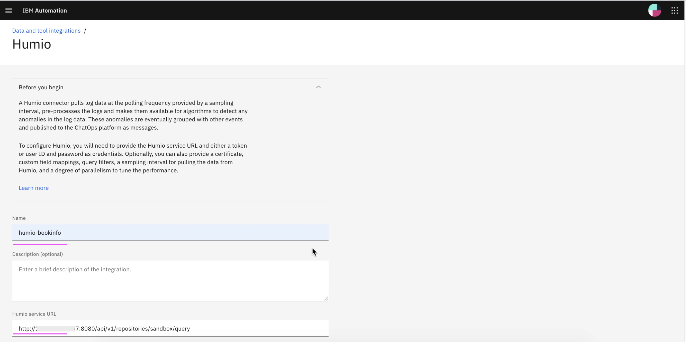
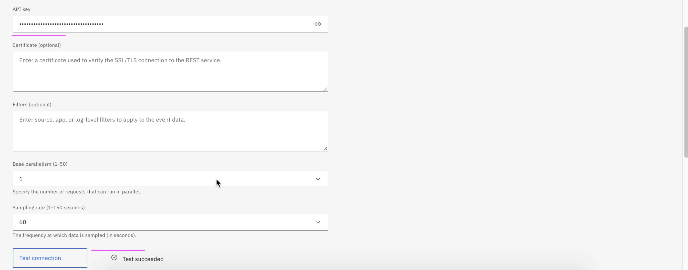
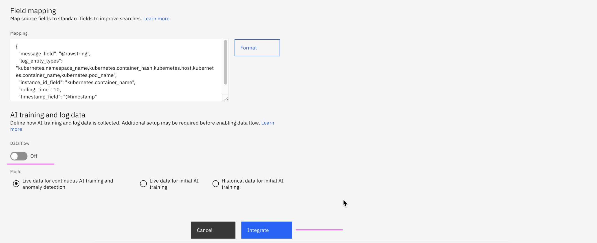
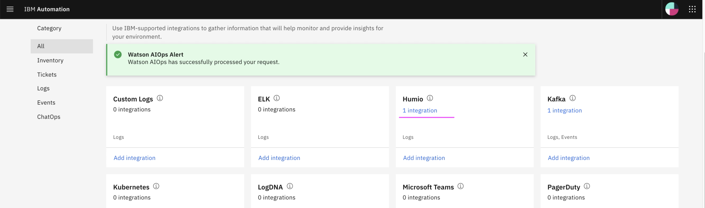

# Setup Humio Integration

This article explains about how to setup Humio Integration in Watson AIOps.

The article is based on the the following.

- RedHat OpenShift 4.6 on IBM Cloud (ROKS)
- Watson AI-Ops 3.1.0

1. Goto the page `Data and tool integrations`

2. In the `Humio` card click on the `Add Integration` link

3. Enter the below field values

- Name 
- Humio sevice URL

    Sample value : http://1.1.1.1:8080/api/v1/repositories/sandbox/query

- API Key of the Humio
- Keep `Data flow` off

4. Click on `Integrate` 

5. Integration is created.

