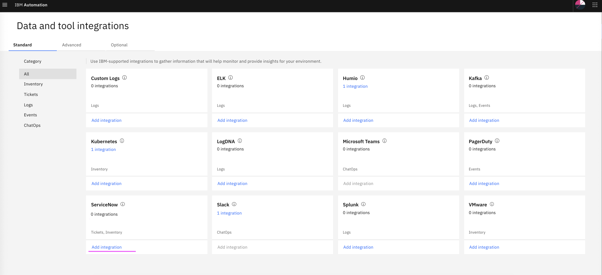
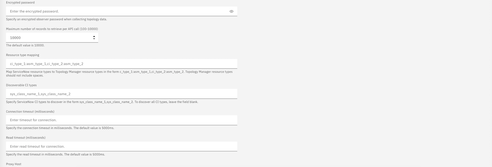
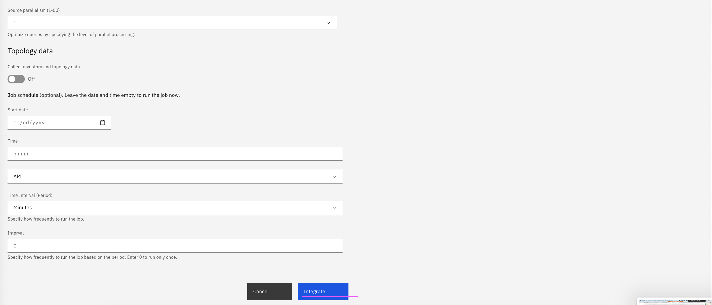

# Setup ServiceNow Integration

This article explains about how to setup ServiceNow Integration in Watson AIOps.

The article is based on the the following.

- RedHat OpenShift 4.6 on IBM Cloud (ROKS)
- Watson AI-Ops 3.1.0

1. Goto the page `Data and tool integrations`

2. In the `ServiceNow` card click on the `Add Integration` link



3. Enter the below field values

```
- Name 
- URL
    Sample value : https://dev-11111.service-now.com

- UserID
- Password

- Data flow - on
- Historical Data for initial AI Training
- Start date (2 years old)
- End date (current date)
```

4. Click on `Integrate`






5. Integration is created.

