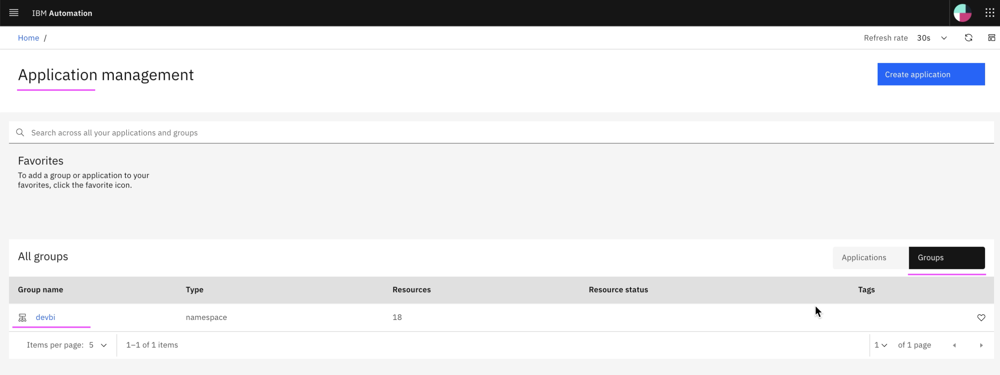

# Setup Kubernetes Integration

This article explains about how to setup Kubernetes Integration in Watson AIOps.

The article is based on the the following

- RedHat OpenShift 4.6 on IBM Cloud (ROKS)
- Watson AI-Ops 3.1.0

1. Goto the page `Data and tool integrations`

2. In the `Kubernetes` card click on the `Add Integration` link

3. Enter values for highlighed field and click on `Integrate`

The below table describes some important fields.

<table>
    <tr>
        <td>Field</td>
        <td>Description</td>
        <td>Sample Value</td>
    </tr>
    <tr>
        <td>Name</td>
        <td>Name of the application</td>
        <td>bookinfo</td>
    </tr>
    <tr>
        <td>Data Center</td>
        <td>Data Center in which the applicaiton is available</td>
        <td>bookinfo-dc</td>
    </tr> 
    <tr>
        <td>Connection type</td>
        <td>Local or Remote cluster</td>
        <td>Load  (for remote cluster)</td>
    </tr>
    <tr>
        <td>Kubernetes master IP address</td>
        <td>IP address / domain of IKS/OCP cluster where your app is installed</td>
        <td>c111.us-south.containers.cloud.ibm.com</td>
    </tr>
    <tr>
        <td>Kubernetes API port</td>
        <td>Port of IKS/OCP cluster where your app is installed</td>
        <td>12345</td>
    </tr>    
    <tr>
        <td>Encrypted Kubernetes token</td>
        <td>

Refer [here](https://github.com/ibm-gsi-ecosystem/watson-ai-ops-guide/tree/master/600-getting-cluster-access-token)
       
Refer KC [here](https://www.ibm.com/docs/en/cloud-paks/cp-waiops/3.1.0?topic=integrations-kubernetes)
        </td>
        <td></td>
    </tr>
    <tr>
        <td>Namespaces to observe</td>
        <td>Namespaces where your app installed</td>
        <td>devbi</td>
    </tr>  
    <tr>
        <td>Interval</td>
        <td>Interval minutes in which the observer jobs to be executed</td>
        <td>5</td>
    </tr>
</table>

5. Goto on `Application Management` 

The given namespace `devbi` is observed and a group with the same name `devbi` is created. 

