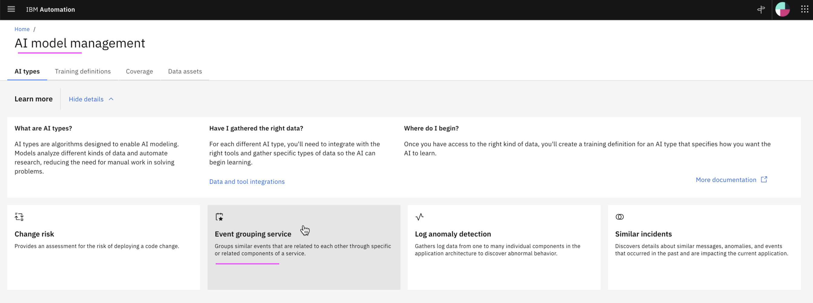
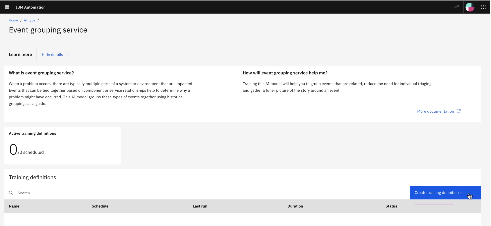
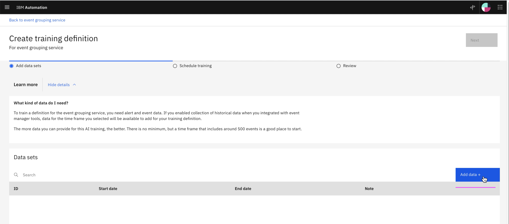
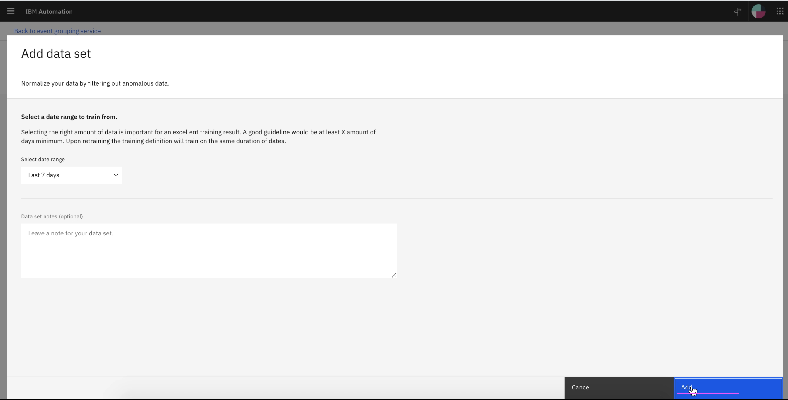
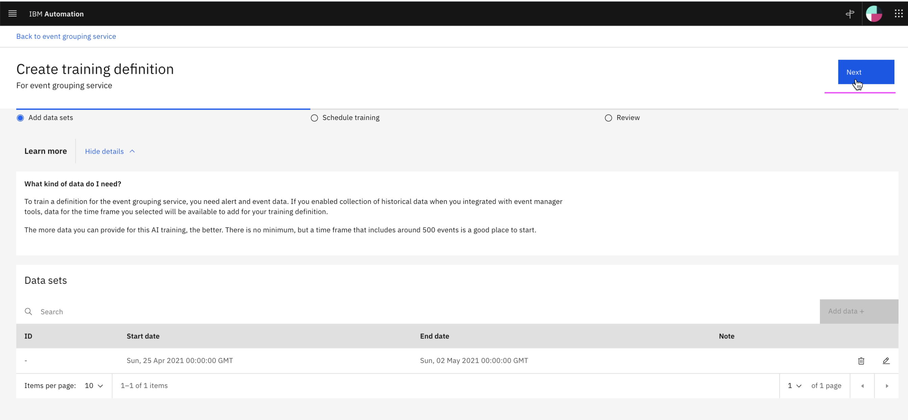
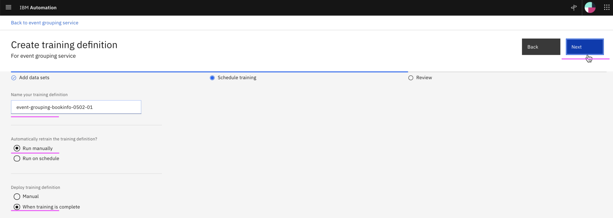
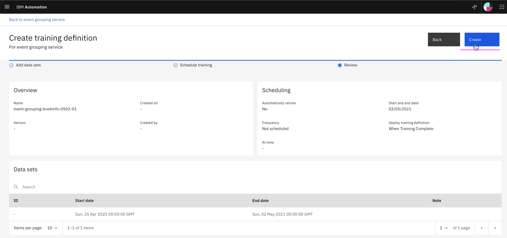
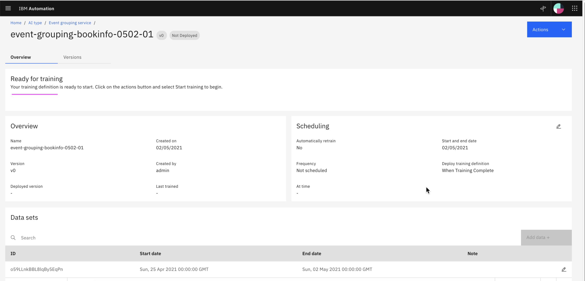

# Create Training Definition for Event Grouping

This article explains about how to Create Training Definition for Event Grouping in Watson AIOps.

The article is based on the the following

- RedHat OpenShift 4.6 on IBM Cloud (ROKS)
- Watson AI-Ops 3.1.0

1. Goto the page `Data and Model Management`

2. Click on `Event Grouping Service` card

3. Click on `Create training definition`  to create a new training definition.

4. Click on `Add data`

5. Click on `Add` button to add the data set.

Here last 7 days is choosen by default. Make sure you click the list box and choose the current day + 1 for the training.

6. Click on `Next`

7. Enter value in `Name your training definition` text box. You can enter any value here for your reference.

8. Click on `Next`

9. Review the values and Click on `Create` button.

10. The training definition is created for the event grouping.

