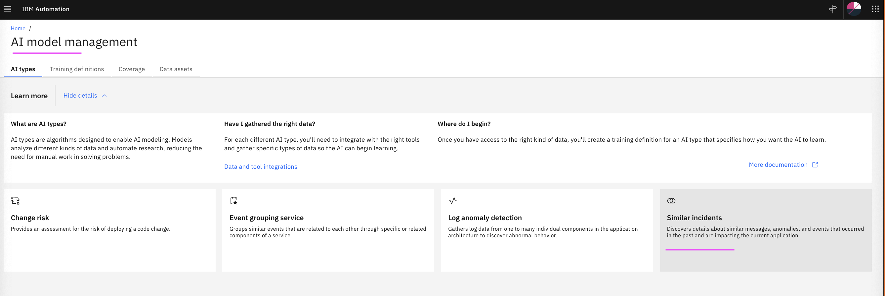
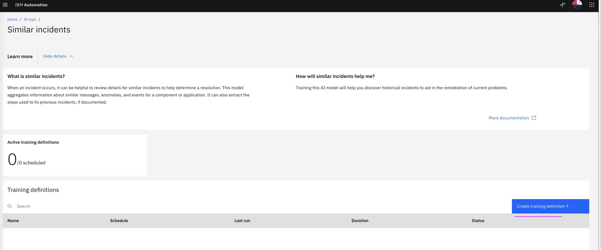
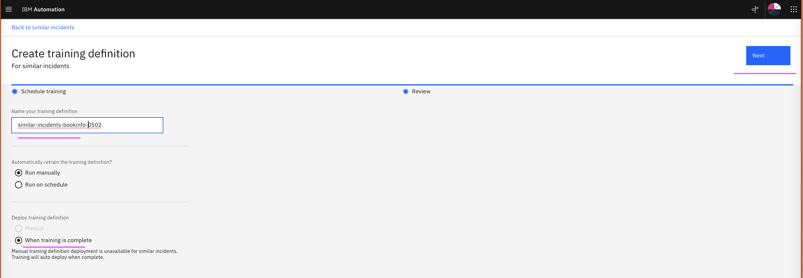
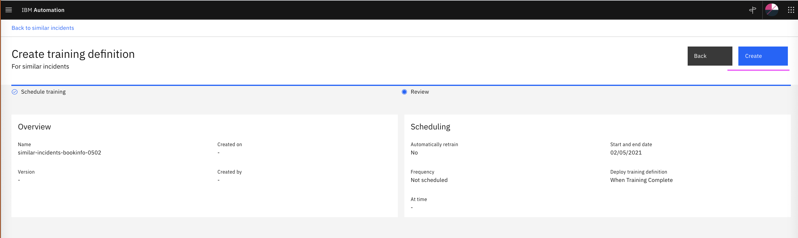
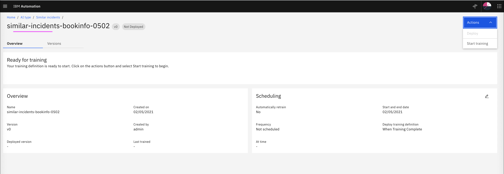

# Create Training Definition for Similar Incidents

This article explains about how to Create Training Definition for Similar Incidents in Watson AIOps.

The article is based on the the following

- RedHat OpenShift 4.6 on IBM Cloud (ROKS)
- Watson AI-Ops 3.1.0

1. Goto the page `Data and Model Management`

2. Click on `Similar Incidents` card

3. Click on `Create training definition`  to create a new training definition.

4. Enter value in `Name your training definition` text box. You can enter any value here for your reference.

5. Click on `Next`

6. Review the values and Click on `Create` button.

7. The training definition is created for the similar incidents.

