# Training - Log Amomaly Detection

This article explains about how to do Training of Log Amomaly Detection in Watson AIOps.

The article is based on the the following

- RedHat OpenShift 4.6 on IBM Cloud (ROKS)
- Watson AI-Ops 3.1.0

## Application

Here is the application page looks like.

And assume that app is accessible via link http://1.1.1.1:31600/productpage?u=normal

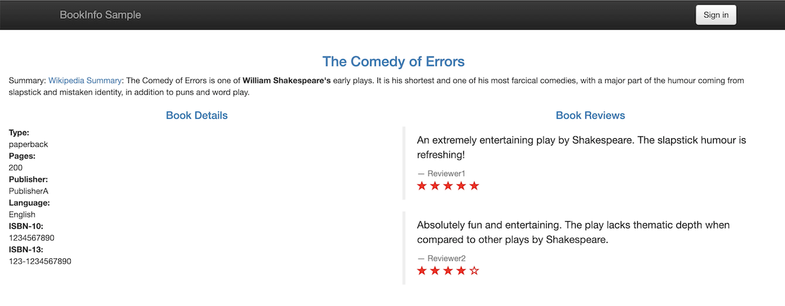

## Generate Load

The below script can be used for generating load.

Run this script and Generate load.

```bash
#!/bin/bash

while (true)
do
    ab -n 100 -c 5 http://1.1.1.1:31600/productpage?u=normal
done

```

## Load Live logs for Training

Enable the live logs for the training.

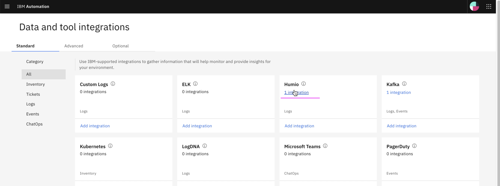
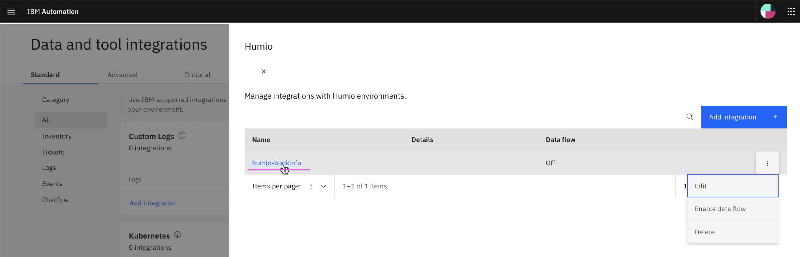
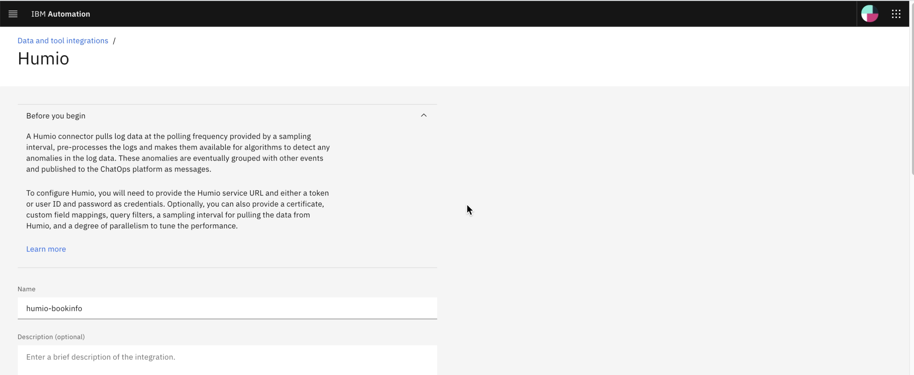
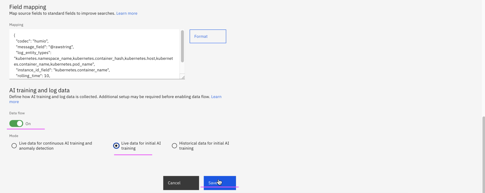

Keep in this state for 10 minutes.

## Stop Live logs

After 10 minutes, live logs can be disbled.

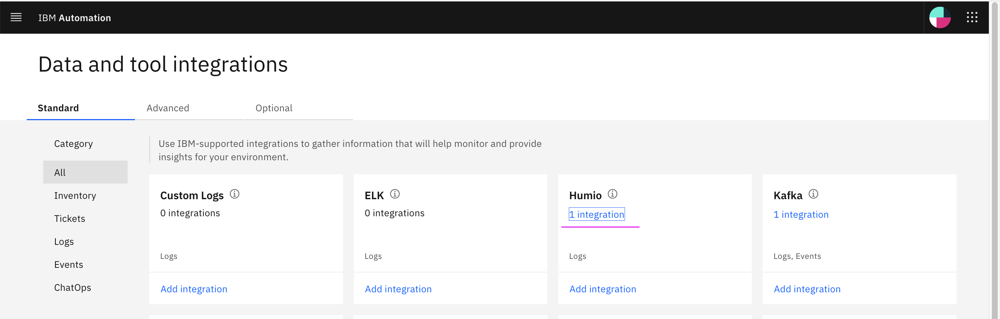
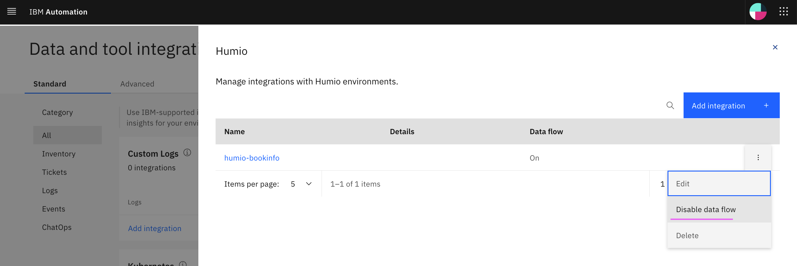
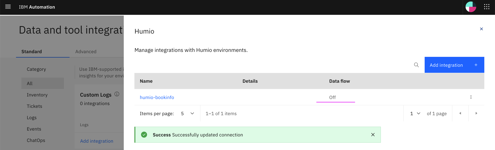

## Stop Load

Click on Ctrl+C to stop load script.

## Start Training

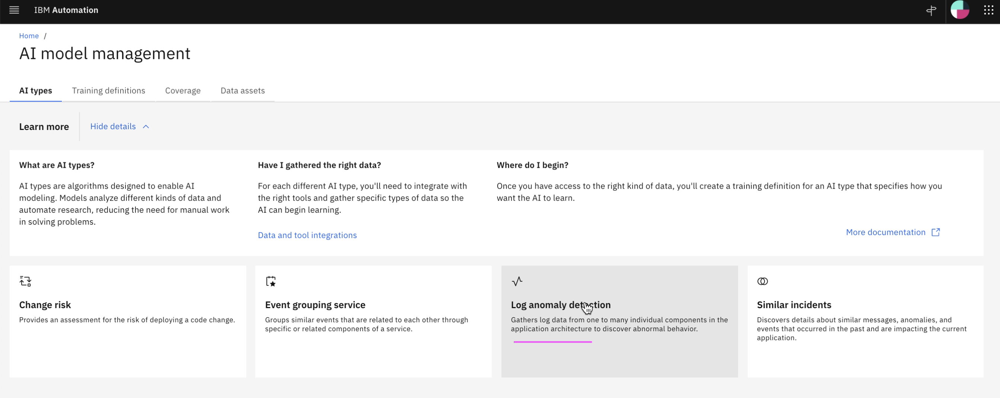
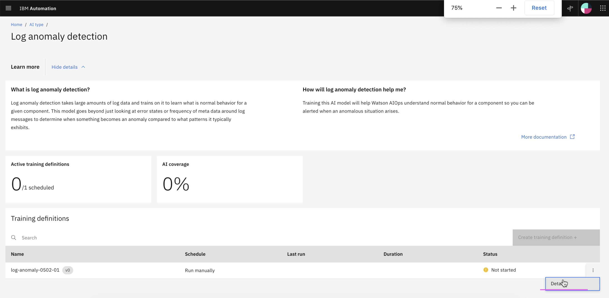
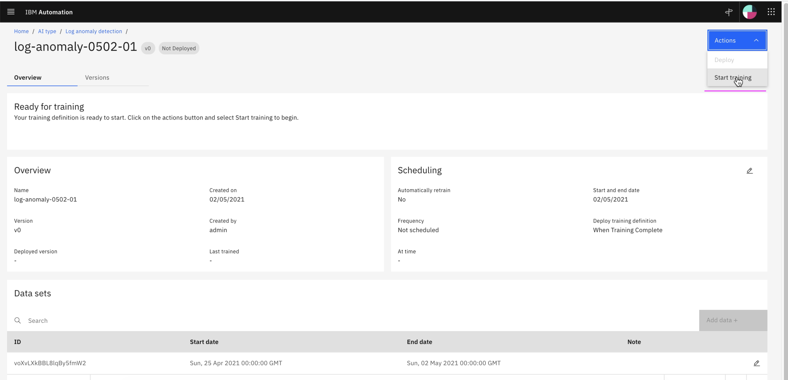

Training is started.

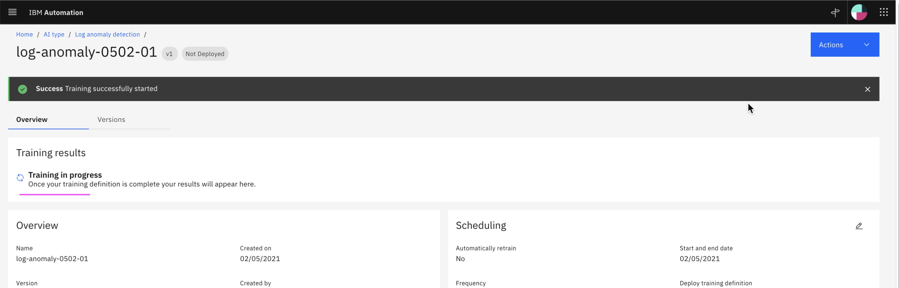

If you have this `Needs improvement` status then you need to load some more logs.

Need around 10K lines logs for each component/micro service of the app.

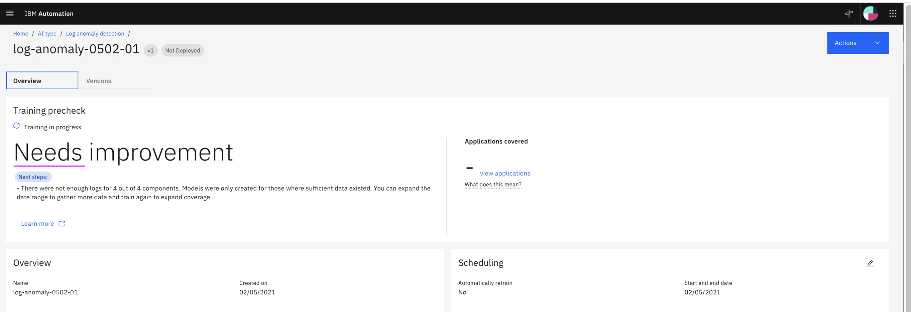

Now the trianing status is `Good` and `Deployed`.

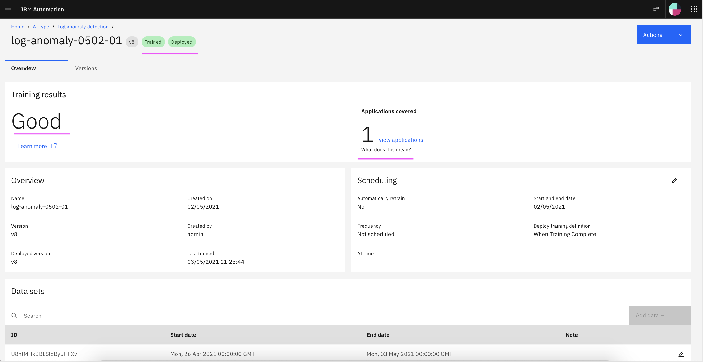

The trained version is `v8`.

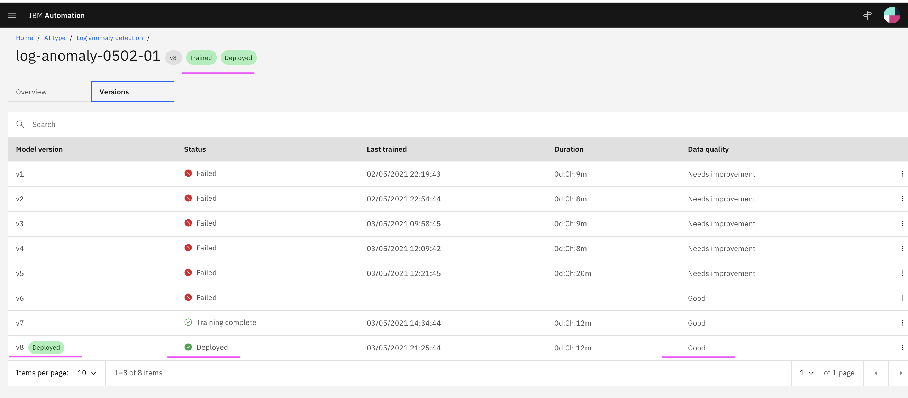

