# Training - Event Grouping

This article explains about how to do Training of Event Grouping in Watson AIOps.

The article is based on the the following

- RedHat OpenShift 4.6 on IBM Cloud (ROKS)
- Watson AI-Ops 3.1.0


## Preparation

### Sample Events Files for Training

The sample events data file is available here [02-noi-alerts.json](./files/02-noi-alerts.json).

### Pushing events for Training

The script to push events into kafka topic `alerts-noi-1000-1000` for training is available here [01-post-training-events.sh](./files/01-post-training-events.sh).

```bash
oc extract secret/strimzi-cluster-cluster-ca-cert --keys=ca.crt --to=- > ca.crt
export SASL_PASSWORD=$(oc get secret token --template={{.data.password}} | base64 --decode)
export SEC="-X security.protocol=SSL -X ssl.ca.location=ca.crt -X sasl.mechanisms=SCRAM-SHA-512 -X sasl.username=token -X sasl.password=$SASL_PASSWORD"
export BROKER=$(oc get routes strimzi-cluster-kafka-bootstrap -o=jsonpath='{.status.ingress[0].host}{"\n"}'):443

kafkacat $SEC -b $BROKER -P -t alerts-noi-1000-1000 -l ./02-noi-alerts.json
```

To know more about how to access kafka topics refer here [800-accessing-kafka-topics](../800-accessing-kafka-topics)

## Enable Data flow for Training

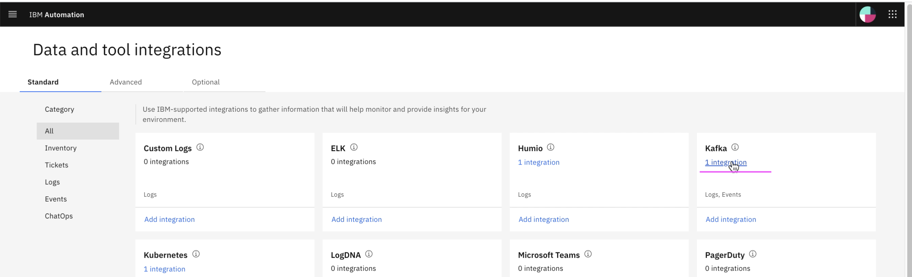
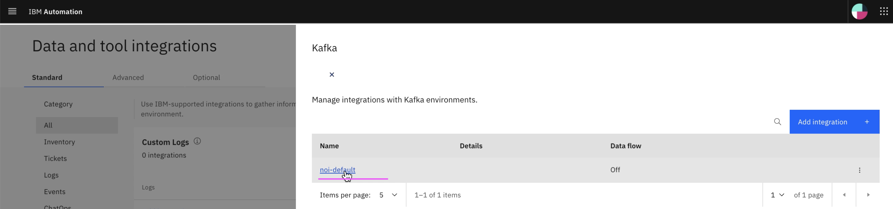
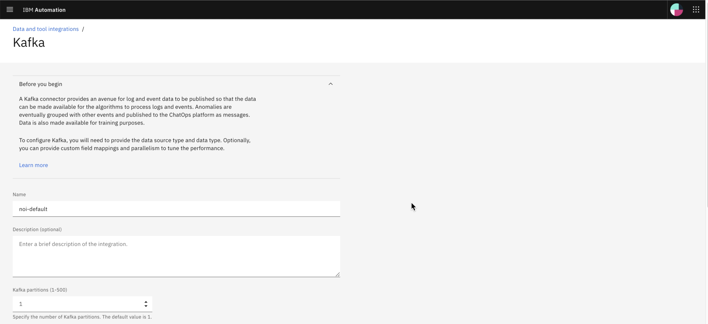
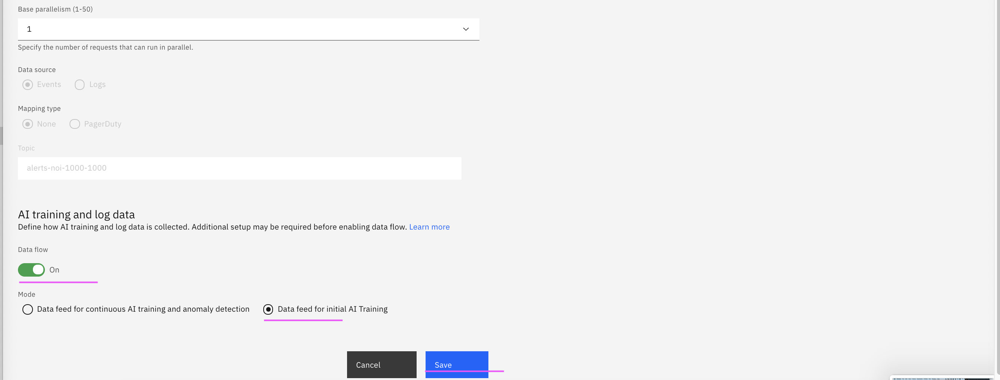

## Push training events to kafka topic

Run the below command to push training events to kafka topic.

```bash
sh ./files/01-post-training-events.sh
```
## Disable Data flow

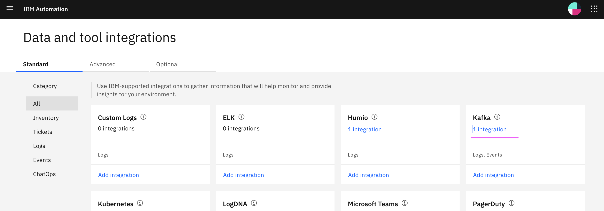
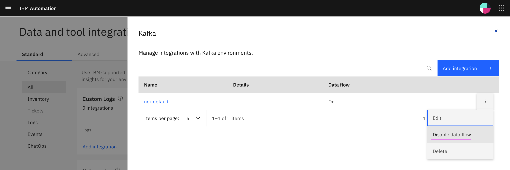
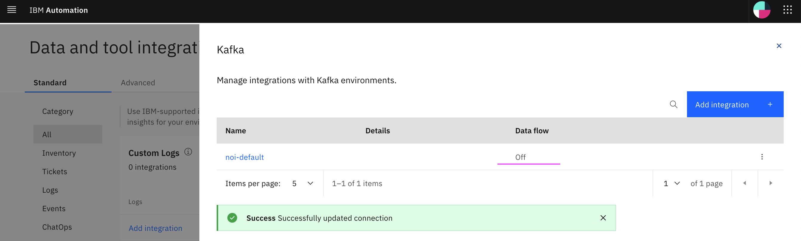


## Start Training

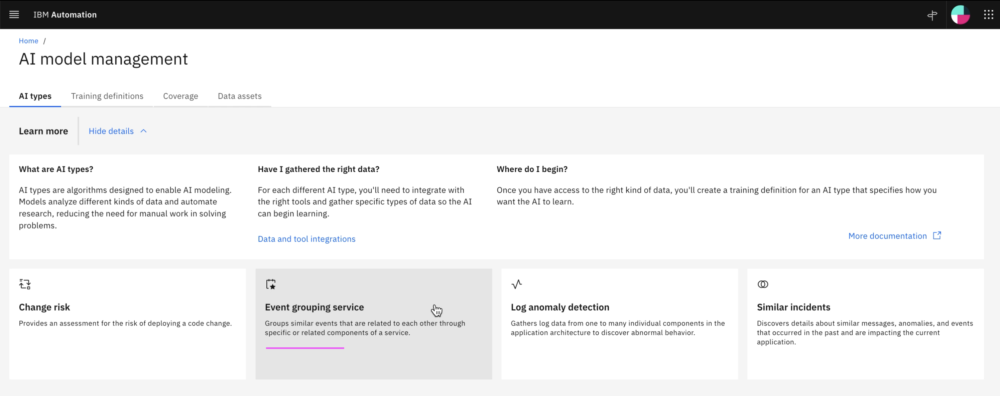
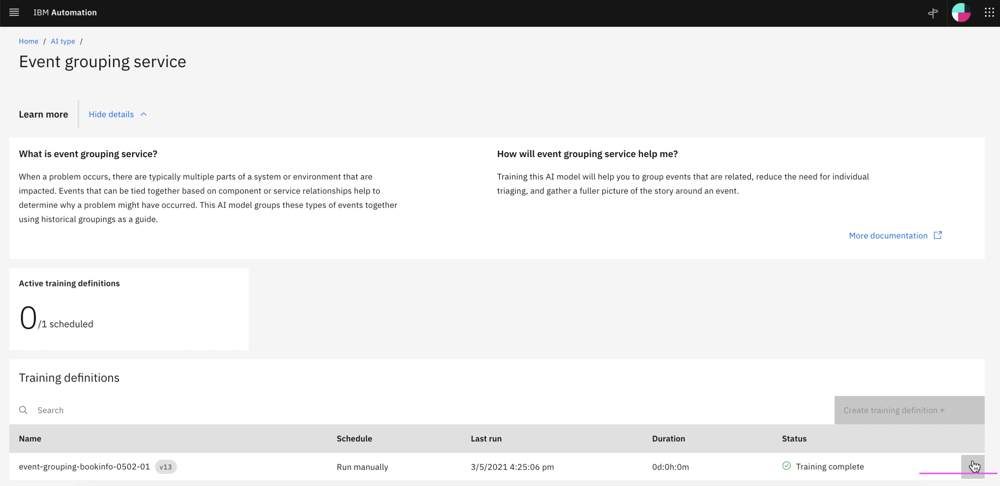
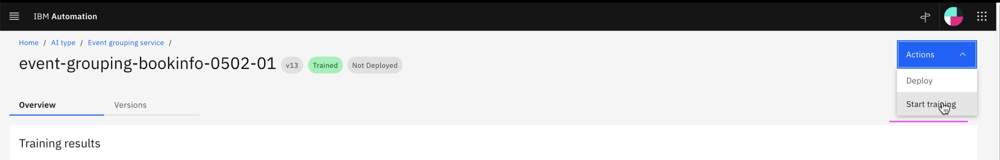
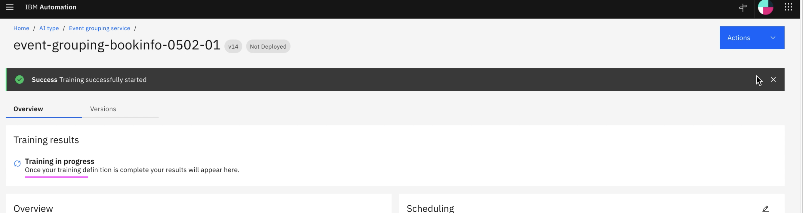
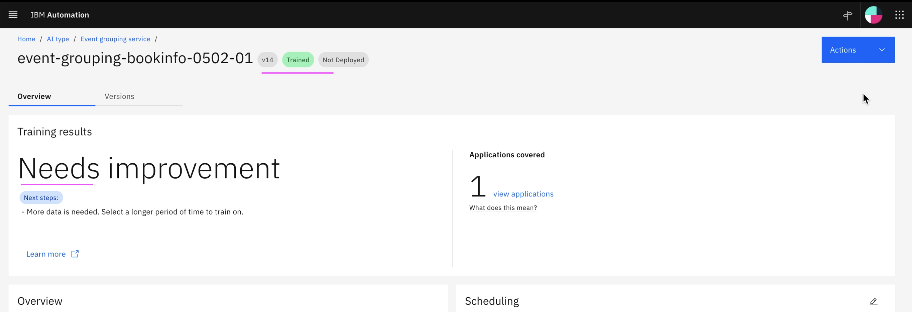
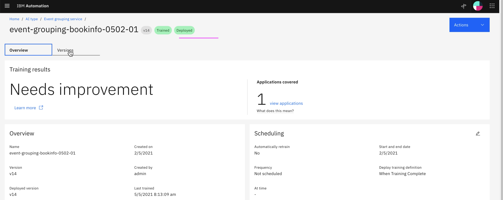
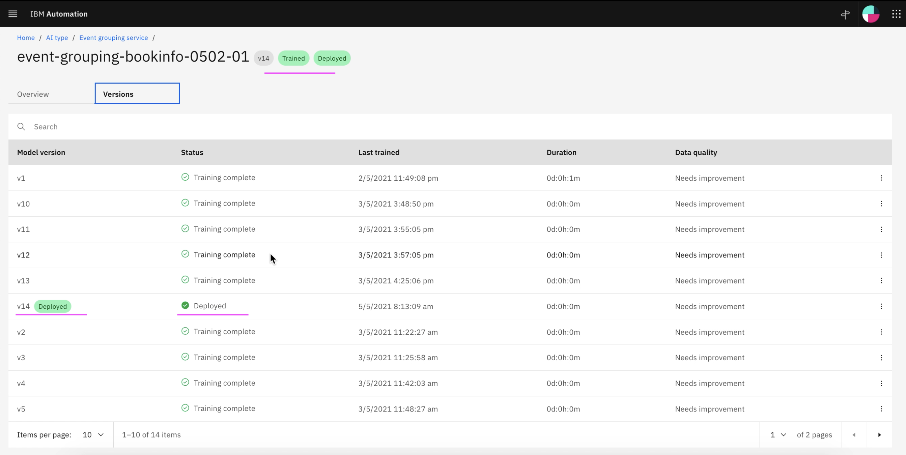

