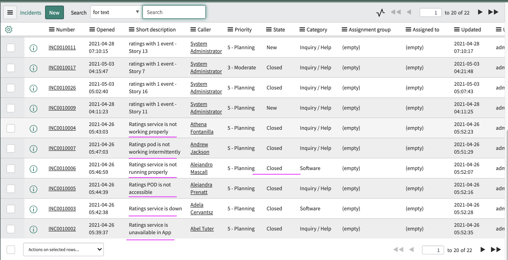

# Training - Similar Incidents

This article explains about how to do Training of Similar Incidents in Watson AIOps.

The article is based on the the following

- RedHat OpenShift 4.6 on IBM Cloud (ROKS)
- Watson AI-Ops 3.1.0

## Preparation

### Sample Incidents  for Training

Atleast 5 incidents should have been created in service-now, resolved with proper resolve comments and closed.

Here are the sample incidents from service now.

## Enable Data flow for Training

Make sure the following

- Data flow is on
- Historical data for Initial AI-Training
- Start Date should be past date 
- End Date could be current date 

## Start Training

Start the training

