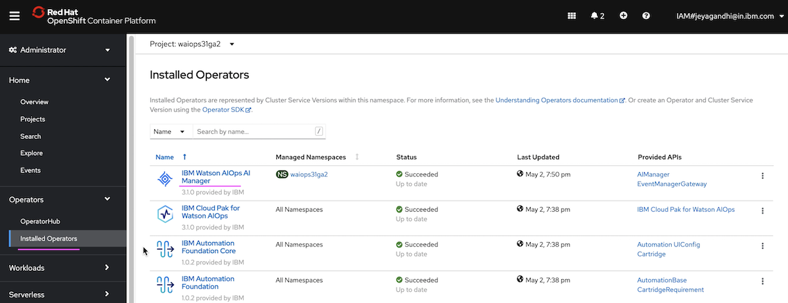
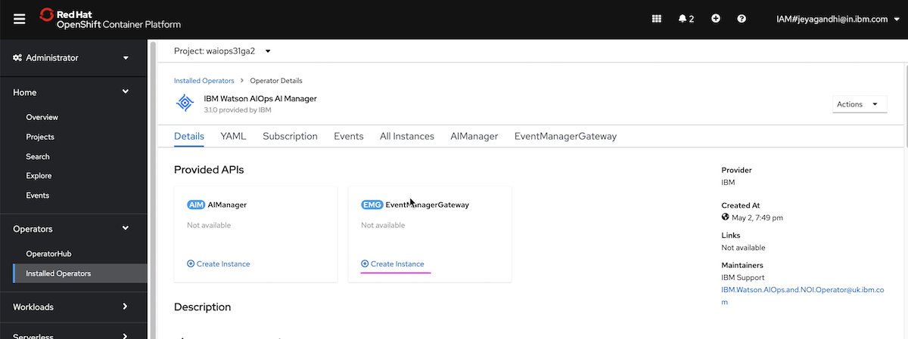
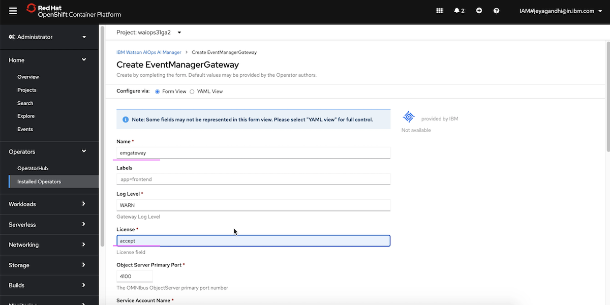
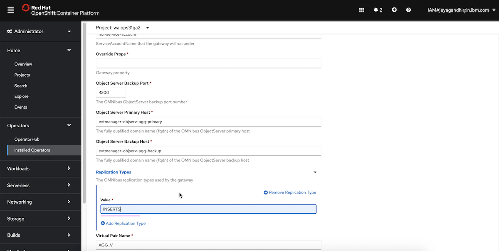
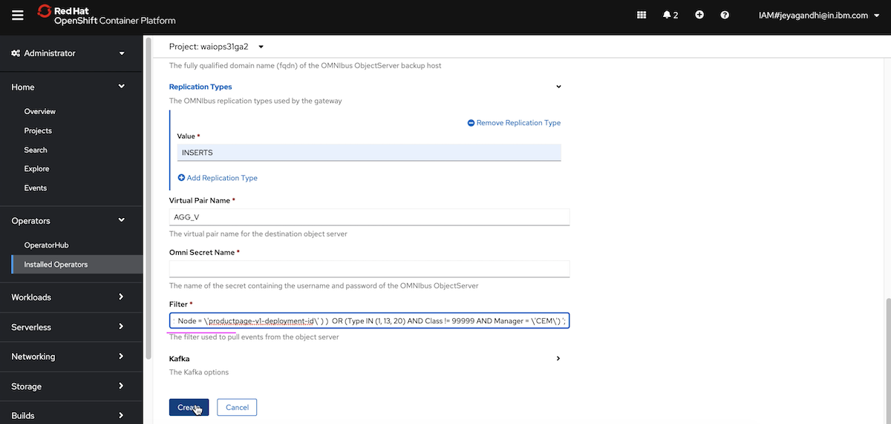
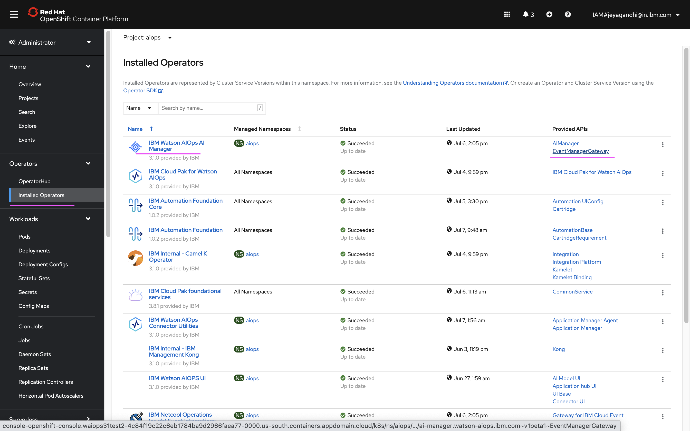
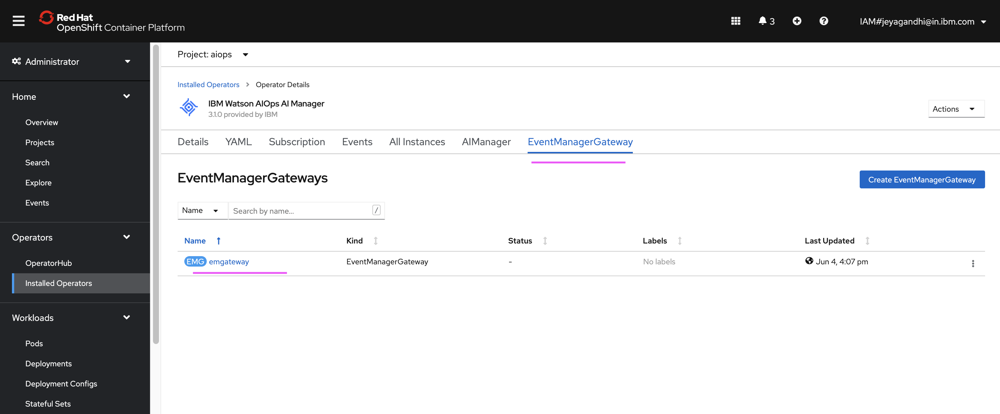
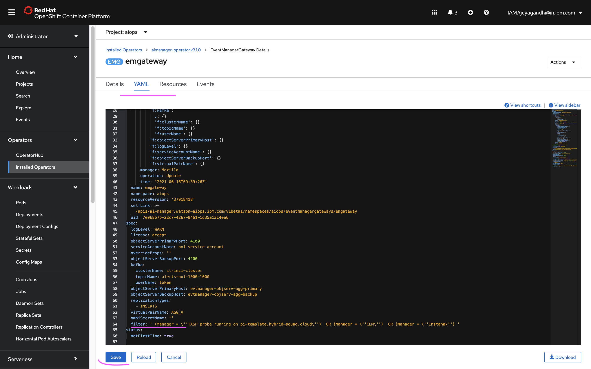

# Configure Event Manager Gateway

The article explains about how to Configure Event Manager Gateway in Watson AIOps. This event manager gateway helps to push events from Event Manager to AI-Manager.

The article is based on the the following

- RedHat OpenShift 4.6 on IBM Cloud (ROKS)
- Watson AI-Ops 3.1.0


## 1. Create Event Manager Gateway

Here are the steps to create Event Manager Gateway.

1. Goto `Installed Operators` Page in the Openshift Container Platform. 



2. Click on `IBM Watson AIOps AI Manager` operator

3. Click on `Create Instance` in `Event Manager Gateway` card



4. Enter any value in `Name` field



5. Enter `accept` in`License` field

6. Enter `INSERTS` in`Replication Type` field



7. Enter the below value in `Filter` field. This is to filter the events, Only the events satisfying the filtered conditions would be send to AI-Manager.

This Step is Optional. 

You can give the below value to send only the events with Severity greter than 3.

```
( Severity>3 )

```

For the bookinfo demo setup, you can give this value.

```
( Type IN (1, 13, 20) AND Class != 99999 AND Manager = \'CEM\')
```

If you have metrics manager installed, you can have the filter like this.


```
( (Manager = \'TASP probe running on pi-demo.hybrid-squad.cloud\') AND ( Node = \'details-v1-deployment-id\' OR  Node = \'productpage-v1-deployment-id\' ) )  OR (Type IN (1, 13, 20) AND Class != 99999 AND Manager = \'CEM\')
```



8. Click on `Create` button

The event mangaer gateway should have been created.

## 2. Update filters in Event Manager Gateway

If you want to update the filter after you created gateway, follow the steps below.


1. Goto `Installed Operators` 

Click on `EventManagerGateway` link in the `IBM Watson AIOps AI Manager` operator 



2. In the tab `EventManagerGateway`, click on the instance. Here it is `emgateway`



3. Click on tab `Yaml`, it shows yaml file. Here `filter` field at the line no. `64`.

Update the filter and save it.



## Reference: 

https://www.ibm.com/docs/en/cloud-paks/cp-waiops/3.1.0?topic=installing-post-installation-tasks#install-emg-console