# Runbook Creation

1. Go to event manager -> Create Integration --> Automation --> Script --> Configure 
2. Copy the public SSH key into each target system where script has to be executed. 
3. Go to Automation -> Runbooks --> New Automation --> Create a script based automation by copying/typing the required commands. Optionally give the target system IP and username with which script has to be executed in target system --> Save the automation.
4. Go to Library --> New Runbook --> Give name, desc etc and select "Add automation step" and add 5. script automation created in previous step.

Here are the screenshots.

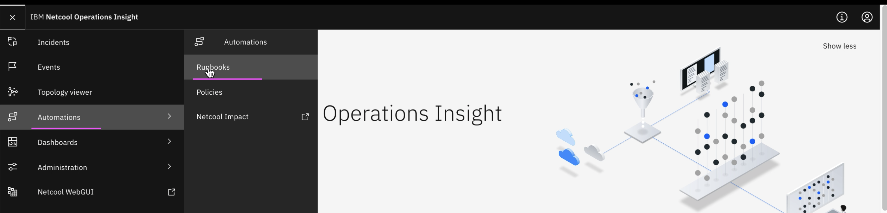

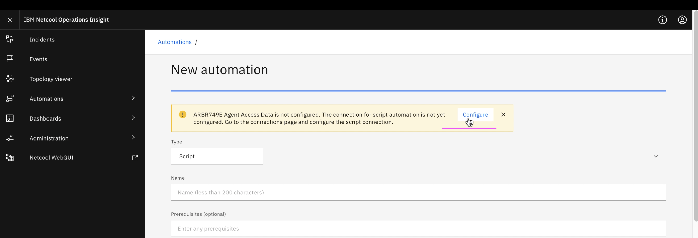
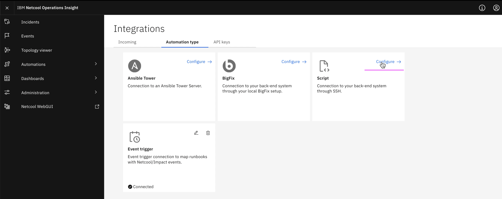
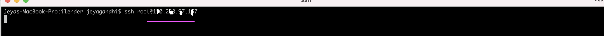

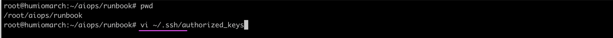
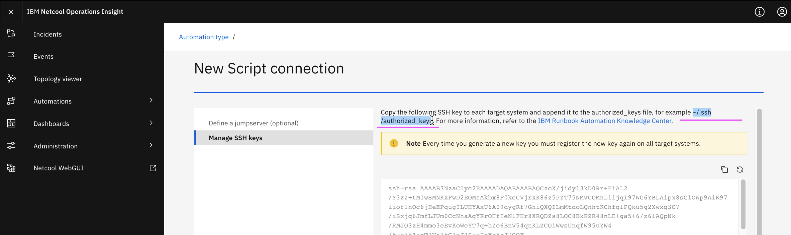
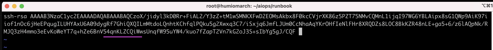
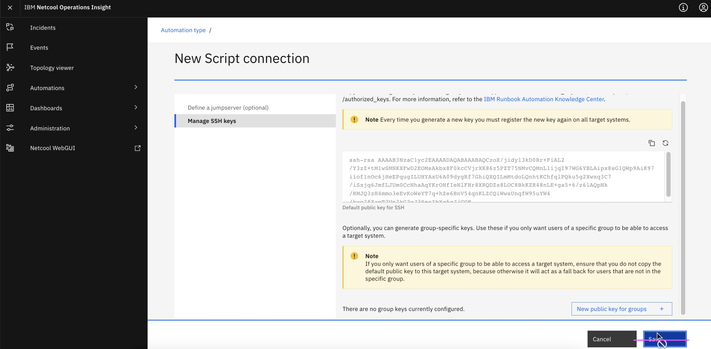
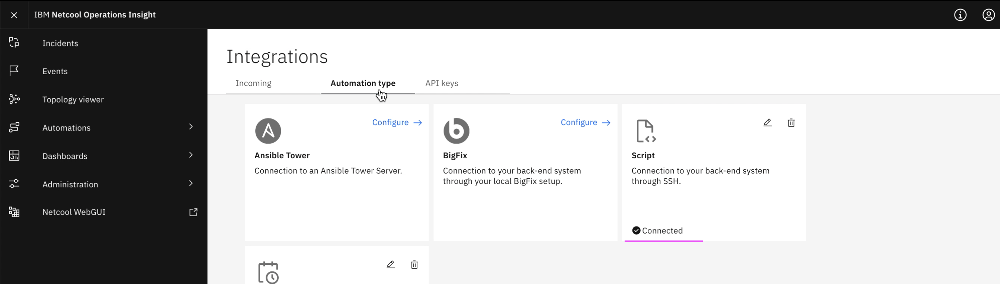

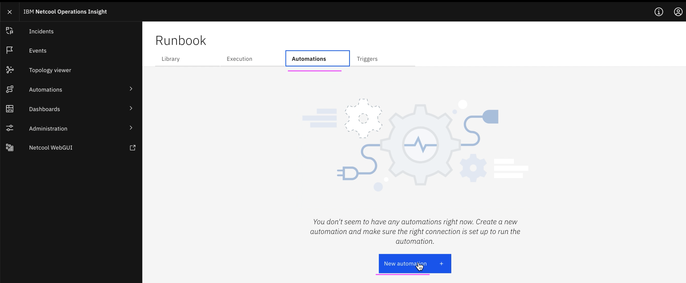

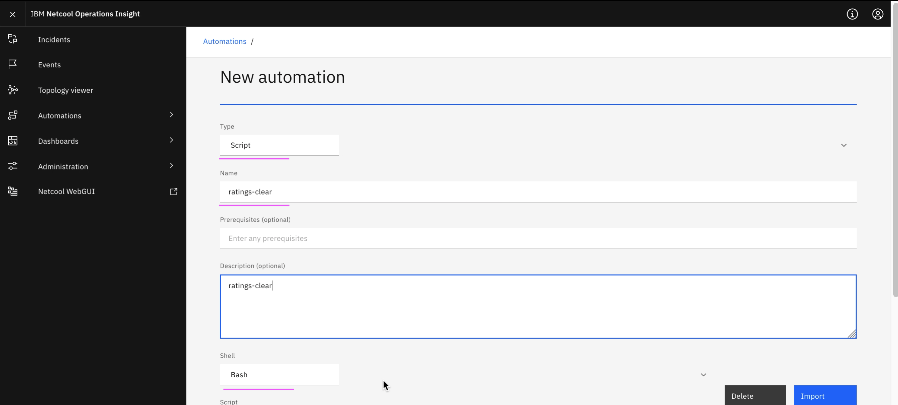

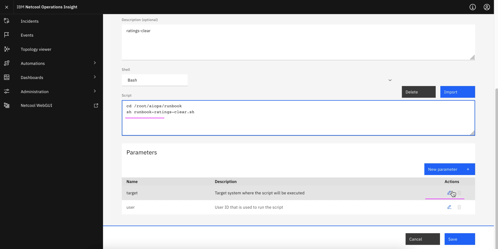
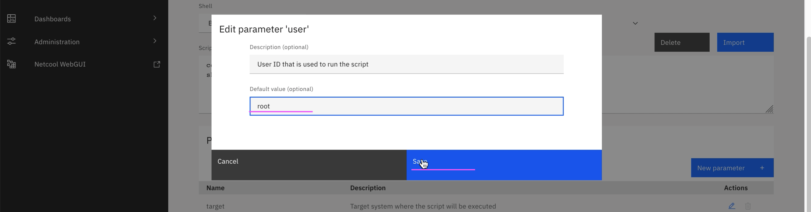
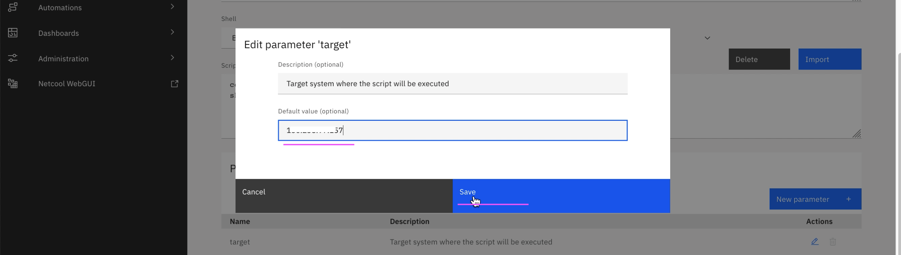
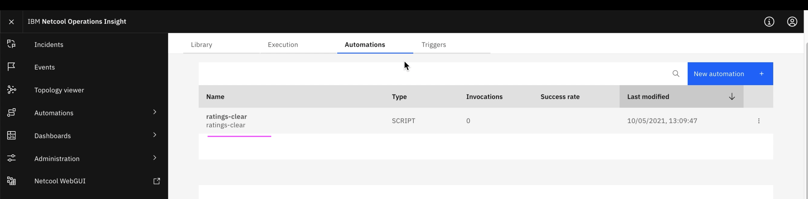
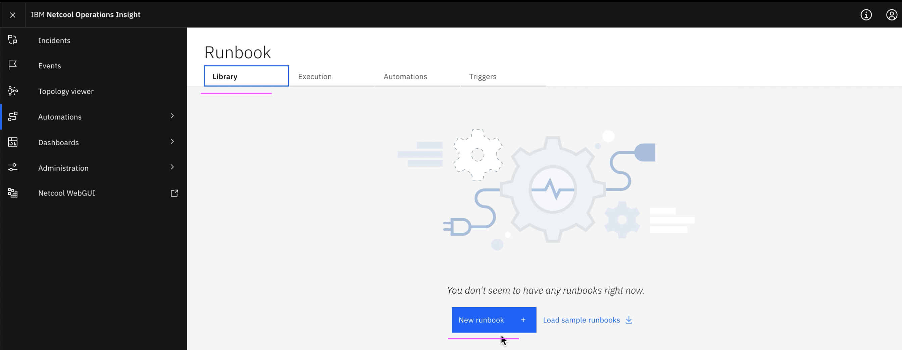

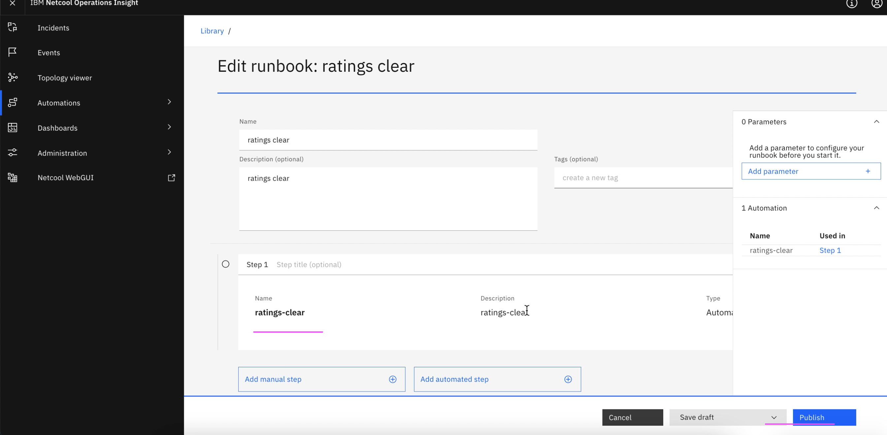
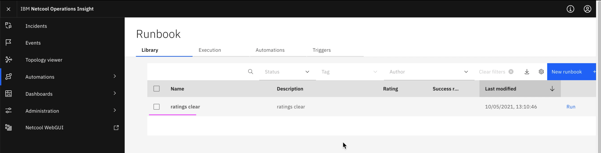
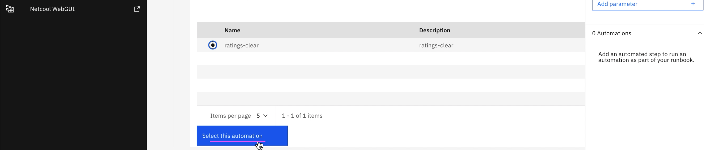

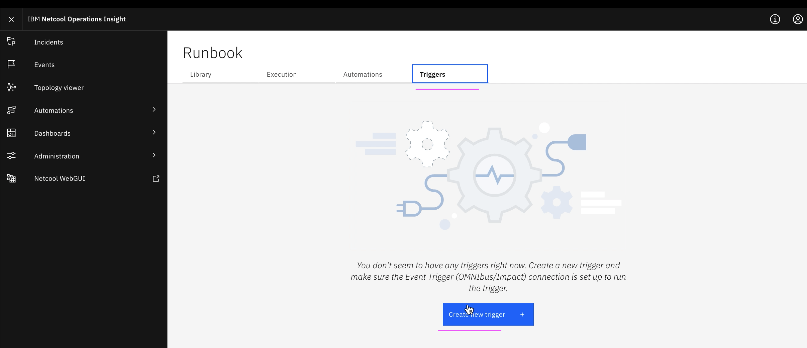
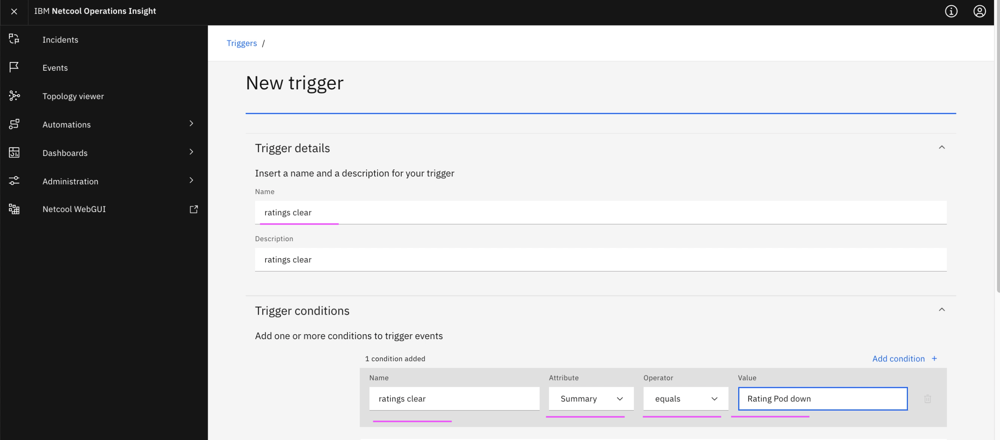
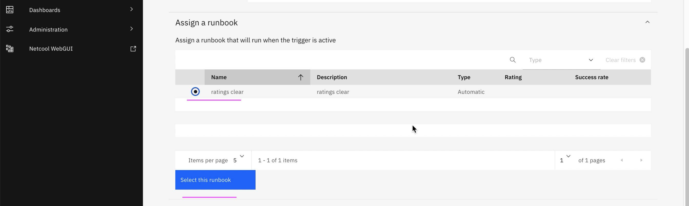
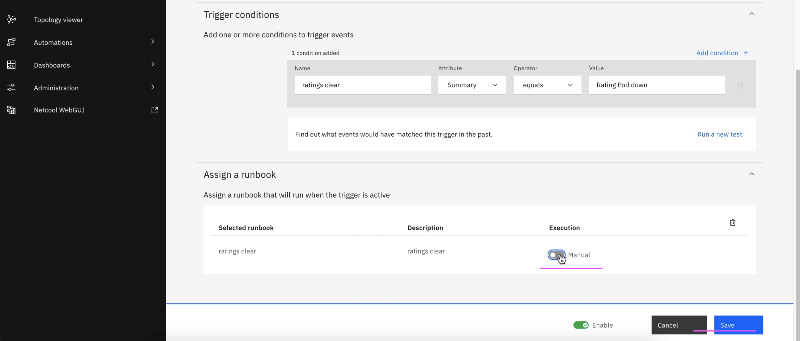

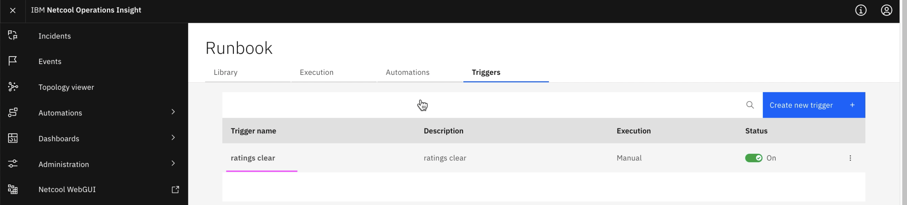

