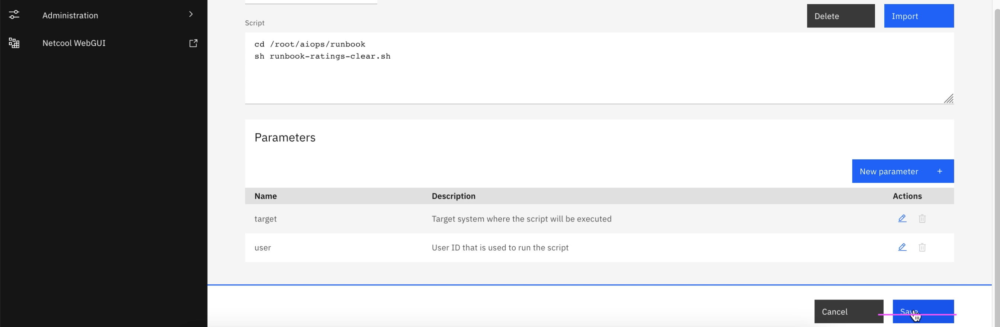
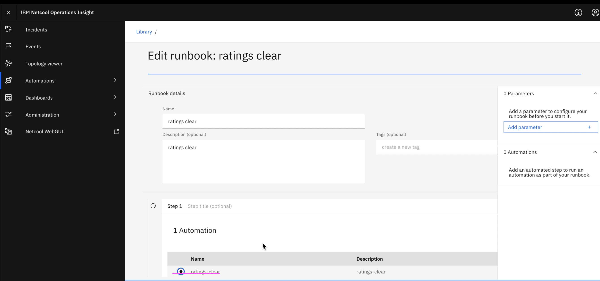
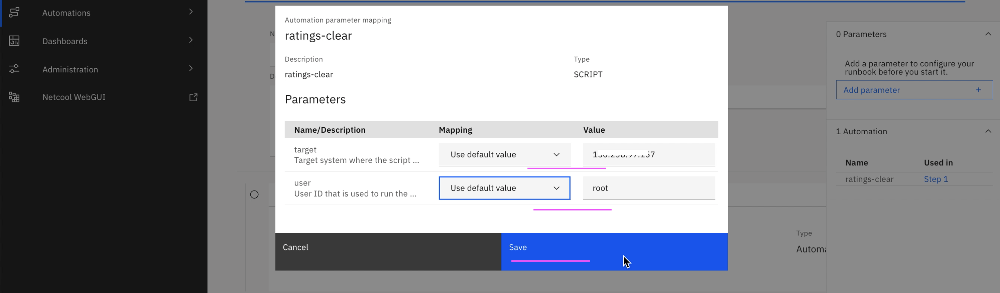

# Runbook Creation

1. Go to event manager -> Create Integration --> Automation --> Script --> Configure 
2. Copy the public SSH key into each target system where script has to be executed. 
3. Go to Automation -> Runbooks --> New Automation --> Create a script based automation by copying/typing the required commands. Optionally give the target system IP and username with which script has to be executed in target system --> Save the automation.
4. Go to Library --> New Runbook --> Give name, desc etc and select "Add automation step" and add 5. script automation created in previous step.

This article explain about how to create run book in Event Manager.

The article is based on the the following

- RedHat OpenShift 4.6 on IBM Cloud (ROKS)
- Watson AI-Ops 3.1.0

## Steps

In the event manager click on `Automation --> Runbook`

We are going to create a Runbook which has some automation scripts.

Click on `Automation --> New Automation`

Being, it is first time, we need to configure Integrations to connect from Event Manager to the target system, from where the script is going to get executed.

Click on `Configure`

You are in Integrations page.

Click on `Configure`

ssh into the target system, from where 

