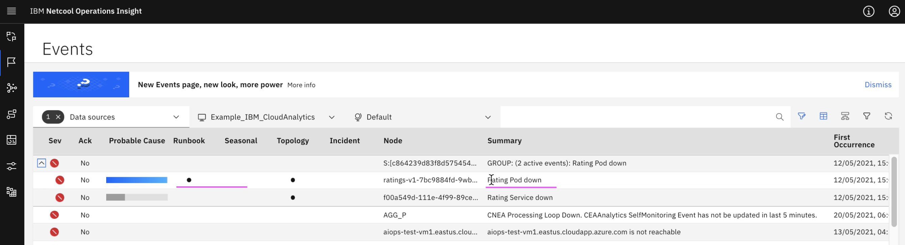

# Runbook Execution

This article explain about how to execute run book in Event Manager.

The article is based on the the following

- RedHat OpenShift 4.6 on IBM Cloud (ROKS)
- Watson AI-Ops 3.1.0

## Steps

Whenever an event created in event manager, the event manager flags the event if the event attribute matches to the trigger condition of any of the runbook stored in event manager.

You can see the dot under `Runbook` column for the `Rating Pod Down` event.

Click on the event record

On the right side, you will have list of actions.

Click on `Launch Runbook`

It opens up the Runbook page.

Click on `Start Runbook`

It contains 1 step only.

Click on `Run`

Step executed and status is successful.

Click on `Complete`

Give feedback about the runbook.

Click on `Runbook Worked`

Click on `Execution`

You can see the execution history.

